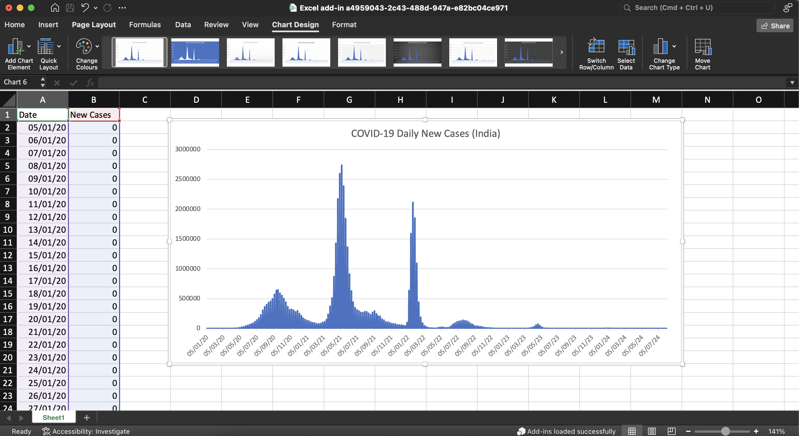

# COVID-19 India Charting Tool (Excel Add-in)

This project is a simple Excel Add-in built with **TypeScript** and the **Excel JavaScript API**. It fetches **India-specific COVID-19 case data** from a CSV file hosted on GitHub and dynamically plots it as a **line chart** inside Excel using **Office.js**.

 

## What It Does

- Parses COVID-19 daily case data for **India** (extracted from global dataset using Python).
- Writes the data into the active Excel worksheet.
- Automatically generates a line chart titled **"COVID-19 Daily New Cases (India)"**.

 

## Technologies Used

- [TypeScript](https://www.typescriptlang.org/)
- [Office.js / Excel JavaScript API](https://learn.microsoft.com/en-us/javascript/api/excel?view=excel-js-preview)
- [Python](https://www.python.org/) (for initial CSV filtering)
- Hosted CSV source: [covid_india.csv](./covid_india.csv)

 

## Final Output

Below is a screenshot of the final chart generated in Excel:

 

## Project Structure

 

## How to Run

1. Clone the repo.
2. Install dependencies and sideload the Excel Add-in (see [official guide](https://learn.microsoft.com/en-us/office/dev/add-ins/quickstarts/excel-quickstart-javascript?tabs=yeomangenerator)).
3. Open Excel and run the Add-in. It will:
   - Fetch the CSV,
   - Fill in data,
   - Create a line chart.

 

## Notes

- This is a simple side project to explore data visualization in Excel using Office.js.
- Built with learning and demonstration in mind.

